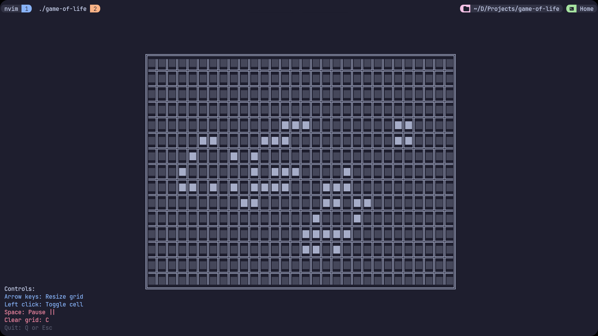

# Game of Life

This is a simple implementation of Conway's Game of Life in Go using the tcell library.



## Requirements

- Go 1.16 or higher

## Installation

First, clone the repository:

```bash
git clone https://github.com/abdulrahmanDev1/game-of-life.git
cd game-of-life
```

Then, download the dependencies:

```bash
go mod download
```

## Building the Application

To build the application, use the `go build` command:

```bash
go build -o game-of-life
```

This will create an executable named `game-of-life`.

## Running the Application

To run the application, you can use the `go run` command:

```bash
go run .
```

Or you can run the built executable:

```bash
./game-of-life
```
